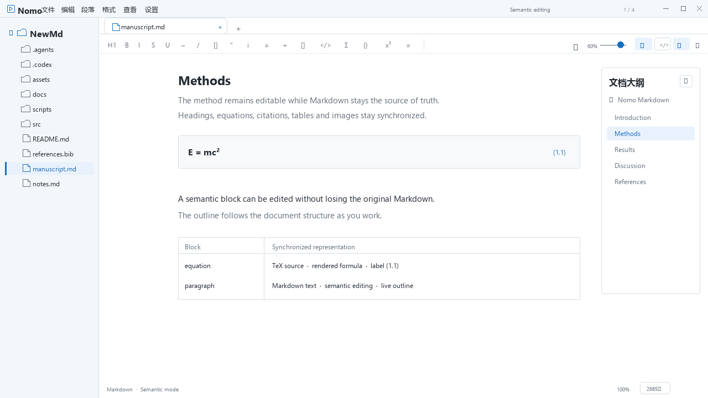

<p align="center">
  
</p>

<h1 align="center"><strong>AcaNomo</strong></h1>

<p align="center">
  <a href="https://github.com/chen-yu-hao/Acanomo/releases">
    
  </a>
  <a href="./LICENSE">
    
  </a>
  
  
  
</p>

<p align="center">
  <a href="./README.md">简体中文</a>
  ·
  <a href="./README.en.md"><strong>English</strong></a>
</p>

---

AcaNomo is a local-first, Markdown-first desktop editor for macOS and Windows. Markdown text remains the source of truth while semantic editing and source mode stay in sync. It also provides academic formula, citation, and review workflows, segmented editing for large TXT and JSON files, file management, document navigation, and desktop integration.

This README tracks the current `main` branch. For the exact capabilities and changes included in an installer, see its matching [GitHub Release](https://github.com/chen-yu-hao/Acanomo/releases). `v0.5.9` fixes the macOS Quick Look build on a clean runner and restores the arm64 `.dmg` release asset.

<p align="center">
  
</p>
<p align="center"><sub>Basic workflow GIF (illustrated UI): semantic editing, Zotero citations, Git review, and Nature/ACS export.</sub></p>

<p align="center">
  
</p>

## Download and Installation

Download the appropriate package from [GitHub Releases](https://github.com/chen-yu-hao/Acanomo/releases):

| System                        | Minimum Version | Recommended Download                                                                       |
| :---------------------------- | :-------------- | :----------------------------------------------------------------------------------------- |
| macOS (Apple Silicon / arm64) | 12.0+           | `.dmg`, or install with Homebrew                                                           |
| Windows                       | 10/11           | `AcaNomo_<version>_x64-setup.exe` installer / `AcaNomo_<version>_x64.zip` portable package |

macOS can also be installed with Homebrew:

```bash
brew tap chen-yu-hao/Acanomo https://github.com/chen-yu-hao/Acanomo
brew install --cask nomo
```

If it is already installed, run `brew upgrade --cask nomo`.

When a release provides `checksums.md5`, use it to verify download integrity.

The current `v0.5.9` release provides Windows x64 NSIS and portable ZIP packages plus a macOS arm64 `.dmg`; check the release's actual assets for any additional formats.

Current GitHub Release builds do not use a Windows publisher code signature or Apple notarization, so SmartScreen or Gatekeeper may prompt on first launch. Download only from this project's Releases and verify files against the checksum list when needed.

The Windows NSIS installer and macOS app declare support for opening `.md`, `.markdown`, `.txt`, and `.json` files; the portable Windows package does not register these file types automatically. Registration only adds AcaNomo as an “Open with” candidate and never forcibly replaces your defaults. On Windows, AcaNomo settings can also manage the default Markdown opener and the classic context menu.

## Main Features

### Markdown Editing and Rendering

- **Semantic editing and source mode**: ProseMirror renders Markdown as you type while semantic and source editing continue to operate on the same document. You can choose the default mode.
- **Split content following**: Both panes keep their natural heights. Content anchors at 30% of each viewport map scrolling continuously without alignment spacers. Manual scrolling takes priority; caret assistance only scrolls the other pane when the corresponding position leaves its 15%–85% visibility band. Pane order, split ratio and an optional reference line remain available. Complex graphics use approximate block positions.
- **Encoding-safe saves**: Markdown opens and preserves UTF-8, UTF-8 BOM, UTF-16 LE / BE BOM, and GBK. Atomic replacement prevents interrupted saves from leaving a partially written file.
- **Complete document elements**: H1–H6, paragraphs, hard breaks, bold, italic, underline, strikethrough, highlight, links, inline code and math, lists, task lists, blockquotes, five callout types, front matter, footnotes, comments, horizontal rules, and safe HTML.
- **Technical content editing**: Code blocks provide Shiki highlighting, titles, language selection, copying, line numbers, and indentation preferences. KaTeX handles inline and display math. Mermaid includes flowchart, sequence, class, state, pie, Gantt, and ER templates, live previews, and fullscreen viewing.
- **Structured tables and navigation**: Choose table dimensions, add or remove rows and columns, align columns, toggle headers, or delete a table. In-document TOCs track headings, while heading-level indicators, the outline, and footnote navigation help with long documents.

### Academic Writing and References

- **Equation numbering and references**: Display equations support automatic, section-based, and manual numbering. Inline equations can carry labels. Equation references become clickable cross-references and stay synchronized between semantic and source modes.
- **Local Zotero connection**: AcaNomo reads item metadata, citation data, and export records through the local Zotero API (default `http://127.0.0.1:23119/api`, equivalent to `http://localhost:23119/api/`). Start Zotero and allow local API access before inserting references.
- **Markdown citation syntax**: Type `[@D9PGQUM4; @T4IQZGRM; @MRHTZ5CI]`, or use Edit → Academic Citations → Insert Citation. Both numeric and author–year styles are supported. `<!-- markedown:bibliography -->` is the default bibliography placeholder and can be moved elsewhere in the manuscript.
- **Document-level settings**: Use Edit → Academic Citations → Document Numbering to choose equation numbering and citation style. Refresh References reloads the items already used in the document.

This is a minimal manuscript fragment. The YAML settings and citation markers remain in the Markdown source:

```markdown
---
equation-numbering: section
citation-style: numeric
---

$$
E = mc^2 \label{eq:energy}
$$

See \eqref{eq:energy}; the result is supported by [@D9PGQUM4; @T4IQZGRM].

<!-- markedown:bibliography -->
```

### Git Review Mode

- **Entry point**: Choose Edit → Review Mode → Enable / Exit Review Mode, or press <kbd>Ctrl</kbd> / <kbd>Cmd</kbd> + <kbd>Shift</kbd> + <kbd>Y</kbd>.
- **Baseline**: A tracked file uses the current Git `HEAD`. An untracked file is saved and committed as a baseline before review starts. If the file is outside a Git worktree, AcaNomo asks before creating a repository in the current directory.
- **Display**: A Git-style unified diff groups contiguous changes. Additions keep the document foreground color with a blue underline; deletions use a temporary red strikethrough. These marks never enter the Markdown file, undo history, or exported documents.
- **Accept and restore**: Accept Current Change stages and commits only the selected hunk, leaving other edits in the worktree. Accept All Changes commits the current Markdown file. Restore from Index restores the worktree and review-session assets from the staged state. If another tool changes `HEAD`, AcaNomo reloads the baseline.

Review mode covers the whole Git worktree, including image files added during the review session. The document must be saved first; live diffing is computed in memory and does not start Git on every keystroke.

### Large TXT / JSON Files

- **Segmented editing engine**: CodeMirror 6 uses chunked reads, whole-file virtual scrolling, and asynchronous line indexing instead of loading an entire large file into the frontend.
- **Full editing flow**: Whole-file line numbers, selection, editing, undo / redo, autosave, Save As, workspace recovery, external-change coordination, and segmented recovery journals.
- **Background whole-file tasks**: Find, replace-all, and copy-all run as streaming background tasks with progress and cancellation. Find and replace also report match / replacement counts, while JSON additionally supports background formatting.

### Files, Workspaces, and Data Safety

- **Explorer**: Browse `.md`, `.markdown`, `.txt`, and `.json`; create files or folders, rename, delete, refresh, collapse all, copy paths, and reveal items in Explorer or Finder.
- **Tabs and multiple windows**: Preview and pinned tabs, a tab overflow list, close other / right / all tabs, recent files and folders, document drag-and-drop, and opening folders in the current or a new window.
- **Save protection**: Enable autosave and configure its delay. Markdown can create a local snapshot before saving. A read-only source or an externally changed, moved, or deleted file pauses autosave and offers the corresponding reload, Save As, overwrite, or ignore flow.
- **State restoration**: Restore workspaces, tabs, window geometry, explorer and toolbar visibility, and the reading or editing position of each Markdown, TXT, and JSON tab.

### Navigation and Writing Assistance

- **Find and replace in the current document**: Markdown, TXT, and JSON share a consistent panel with forward / backward search, whole-word and case-sensitive matching, wrapping, replace-one, replace-all, and result counts.
- **Outline reordering**: Fold headings individually, expand all, or collapse to the configured level. Drag a heading with its descendants before, inside, or after another section; levels adjust automatically and the move remains undoable.
- **Link navigation**: In semantic mode, <kbd>Ctrl</kbd> / <kbd>Cmd</kbd> + click navigates document anchors, opens local Markdown / TXT / JSON files, hands supported PDF, Office, CSV, and image attachments to the operating system, or opens external `http`, `https`, and `mailto` links.
- **Statistics and linting**: The status bar can show lines, words, characters, estimated reading time, and zoom. Markdown linting in Beta provides relaxed / default rules, an issue list, source navigation, and manual retry.

### Images, Clipboard, and Object Operations

- **Image import**: Select, paste, or drop images; copy them next to the document, into a shared `assets` folder, into a document-specific `.assets` folder, or upload through PicGo Server / PicGo-Core. Configure default width, alignment, and optional cleanup of unreferenced local images.
- **Image interaction**: Fullscreen viewing, wheel zoom, panning, and context-menu actions for alignment, size, alt text, copying the image or path, revealing the file, and deleting the node.
- **Desktop clipboard**: Copy and paste rich text, plain text, or images with platform fallbacks. Links, headings, code blocks, tables, math, Mermaid, tabs, the file tree, and the outline provide object-aware context menus.

### Appearance, Windows, and Platform Integration

- **Themes and typography**: Follow the system or choose light / dark mode. Built-in color themes are AcaNomo Default, Amber Paper, Classic Gray, and GitHub, with Classic / Modern blockquote and Callout styles. Font size, line height, content width, interface zoom, and <kbd>Ctrl</kbd> + wheel zoom are configurable.
- **Interface languages**: Follow the system or choose Simplified Chinese, Traditional Chinese, English, or Japanese.
- **Focused windows**: The explorer, toolbar, outline, and statistics toggle independently. Markdown can enter a mini window that shares the current editing state and can be pinned on top. Closing the main window can close it, ask each time, or hide it to the system tray.
- **Export and preview**: Export Markdown as a single HTML file, PDF, Word, or LaTeX. Word and LaTeX exports open a Nature or ACS preset picker first. The ACS LaTeX preset prefers `achemso` and falls back to a compilable `article` structure when it is unavailable. Word presets also set page size, fonts, line spacing, heading styles, and the Zotero bibliography style. HTML uses best-effort image embedding, and PDF export attempts to add heading bookmarks. macOS Quick Look previews themes, code, math, and Mermaid.
- **Desktop integration and updates**: Windows can manage the Markdown default-app candidate and classic context menus for `.md` / `.markdown` files, folders, and folder backgrounds. Startup update checks are enabled by default and can be disabled; NSIS builds download and verify updates in-app, while portable builds only open the ZIP download link. macOS can upgrade with Homebrew.

## Settings and Personalization

| Settings Area             | Available Options                                                                                                                                                                         |
| :------------------------ | :---------------------------------------------------------------------------------------------------------------------------------------------------------------------------------------- |
| General                   | Default semantic / source mode, autosave and delay, pre-save snapshots, interface language                                                                                                |
| Editor                    | Font size, line height, content width, Classic / Modern blockquote and Callout style, large-file threshold, code indentation and line numbers, inline-code rendering, Markdown lint rules |
| Appearance                | System / light / dark mode, four built-in color themes, 80%–160% zoom, Ctrl-wheel zoom                                                                                                    |
| Files and Windows         | Folder-opening target, preview tabs, hide explorer at startup, close-window behavior, default external-change action, Windows file association and classic context menu                   |
| Images                    | Local asset folder or upload strategy, PicGo Server / PicGo-Core, connection testing, default width and alignment, cleanup of unreferenced local images                                   |
| Statistics and Navigation | Outline, document statistics, default metric, reading time, default outline expansion level                                                                                               |
| Advanced and About        | Windows WebView2 hardware / software rendering, default code language and Mermaid type, selected customizable shortcuts, developer logs, startup update checks                            |

## Feature Boundaries

- Find and replace works within the current document; it is not cross-file full-text search.
- Markdown linting is a Beta feature, disabled by default, and reports issues without rewriting the document. It skips large documents and shows at most the first 200 results in the details panel.
- Markdown files above the configured threshold use read-only source mode to reduce rendering pressure. TXT and JSON files use the segmented editor instead.
- Markdown preserves supported source encodings when possible. If new text cannot be represented in a GBK document, saving fails without overwriting the source. TXT and JSON are editable only as UTF-8 or UTF-8 BOM; other encodings open read-only.
- Local links do not support UNC paths, `file://` URLs, query strings, or attachment types outside the allowlist. Relative links require the current Markdown document to be saved.
- Local image-copy strategies require the document to be saved. PicGo upload depends on a user-managed PicGo service or command. Cleanup of unreferenced local images is off by default; when enabled, it deletes matching files inside the document directory.
- Academic references depend on the local Zotero API. When Zotero is offline, an item key is missing, or the local endpoint cannot be reached, unresolved markers remain in the document and export warnings identify the issue.
- Nature and ACS presets are manuscript starting points, not replacements for the current author guidelines. ACS LaTeX's `achemso` and Nature LaTeX's `naturemag.bst` must be supplied by the user's TeX environment; portable fallbacks and warnings are used when they are missing.
- Git review mode requires a saved Markdown file. Its baseline, staging, and commits are controlled by the current Git worktree; inspect the reloaded baseline after an external commit or rebase.
- PDF export is available on Windows and macOS and currently uses fixed A4 portrait pages with 20 mm margins. Quick Look is macOS-only and currently reads UTF-8 Markdown.
- Windows NSIS builds can check, download, and install updates in-app. Portable Windows builds can check for updates and open the ZIP download in the system browser; exit AcaNomo and replace the files manually. On macOS, upgrade with Homebrew or download the DMG from the Release page.

## Default Shortcuts

The table uses Windows defaults. Native macOS menus use `CmdOrCtrl` semantics, while some editor shortcuts are still being adapted. Supported combinations can be changed in Settings → Advanced.

### Files and Windows

| Shortcut                                          | Action                 |
| :------------------------------------------------ | :--------------------- |
| <kbd>Ctrl</kbd> + <kbd>N</kbd>                    | Create a Markdown file |
| <kbd>Ctrl</kbd> + <kbd>Shift</kbd> + <kbd>N</kbd> | Create a window        |
| <kbd>Ctrl</kbd> + <kbd>O</kbd>                    | Open a file            |
| <kbd>Ctrl</kbd> + <kbd>Shift</kbd> + <kbd>O</kbd> | Open a folder          |
| <kbd>Ctrl</kbd> + <kbd>S</kbd>                    | Save                   |
| <kbd>Ctrl</kbd> + <kbd>Shift</kbd> + <kbd>S</kbd> | Save as                |
| <kbd>Ctrl</kbd> + <kbd>W</kbd>                    | Close the current file |

### Editing and Formatting

| Shortcut                                         | Action                  |
| :----------------------------------------------- | :---------------------- |
| <kbd>Ctrl</kbd> + <kbd>Z</kbd>                   | Undo                    |
| <kbd>Ctrl</kbd> + <kbd>Y</kbd>                   | Redo                    |
| <kbd>Ctrl</kbd> + <kbd>B</kbd>                   | Bold                    |
| <kbd>Ctrl</kbd> + <kbd>I</kbd>                   | Italic                  |
| <kbd>Ctrl</kbd> + <kbd>U</kbd>                   | Underline               |
| <kbd>Alt</kbd> + <kbd>Shift</kbd> + <kbd>5</kbd> | Strikethrough           |
| <kbd>Ctrl</kbd> + <kbd>&#96;</kbd>               | Inline code             |
| <kbd>Ctrl</kbd> + <kbd>K</kbd>                   | Insert or edit a link   |
| <kbd>Ctrl</kbd> + <kbd>&#92;</kbd>               | Clear inline formatting |

### Academic Writing and Review

| Shortcut                                          | Action                        |
| :------------------------------------------------ | :---------------------------- |
| <kbd>Ctrl</kbd> + <kbd>Shift</kbd> + <kbd>C</kbd> | Insert a citation             |
| <kbd>Ctrl</kbd> + <kbd>Shift</kbd> + <kbd>R</kbd> | Insert an equation reference  |
| <kbd>Ctrl</kbd> + <kbd>Shift</kbd> + <kbd>Y</kbd> | Enable / exit Git review mode |

### Paragraphs and Elements

| Shortcut                                                         | Action                          |
| :--------------------------------------------------------------- | :------------------------------ |
| <kbd>Ctrl</kbd> + <kbd>1</kbd>–<kbd>6</kbd>                      | Heading levels 1 through 6      |
| <kbd>Ctrl</kbd> + <kbd>0</kbd>                                   | Convert to a paragraph          |
| <kbd>Ctrl</kbd> + <kbd>=</kbd> / <kbd>-</kbd>                    | Raise / lower the heading level |
| <kbd>Shift</kbd> + <kbd>Enter</kbd>                              | Line break within a paragraph   |
| <kbd>Ctrl</kbd> + <kbd>Shift</kbd> + <kbd>T</kbd>                | Insert a table                  |
| <kbd>Ctrl</kbd> + <kbd>Shift</kbd> + <kbd>K</kbd>                | Insert a code block             |
| <kbd>Ctrl</kbd> + <kbd>Shift</kbd> + <kbd>M</kbd>                | Insert a math block             |
| <kbd>Ctrl</kbd> + <kbd>Shift</kbd> + <kbd>Q</kbd>                | Toggle a blockquote             |
| <kbd>Ctrl</kbd> + <kbd>Shift</kbd> + <kbd>A</kbd>                | Insert a callout                |
| <kbd>Ctrl</kbd> + <kbd>Shift</kbd> + <kbd>[</kbd> / <kbd>]</kbd> | Ordered / unordered list        |
| <kbd>Ctrl</kbd> + <kbd>Shift</kbd> + <kbd>X</kbd>                | Task list                       |
| <kbd>Ctrl</kbd> + <kbd>Shift</kbd> + <kbd>H</kbd>                | Horizontal rule                 |

### Search, View, and Export

| Shortcut                                                                               | Action                                      |
| :------------------------------------------------------------------------------------- | :------------------------------------------ |
| <kbd>Ctrl</kbd> + <kbd>F</kbd>                                                         | Open or close Find                          |
| <kbd>Ctrl</kbd> + <kbd>H</kbd>                                                         | Open or close Replace                       |
| <kbd>Ctrl</kbd> + <kbd>Tab</kbd> / <kbd>Ctrl</kbd> + <kbd>Shift</kbd> + <kbd>Tab</kbd> | Switch tabs                                 |
| <kbd>Ctrl</kbd> + <kbd>E</kbd>                                                         | Toggle semantic / source mode               |
| <kbd>Ctrl</kbd> + <kbd>Shift</kbd> + <kbd>L</kbd>                                      | Toggle light / dark theme                   |
| <kbd>Ctrl</kbd> + <kbd>Shift</kbd> + <kbd>F</kbd>                                      | Show / hide the explorer                    |
| <kbd>Ctrl</kbd> + <kbd>Shift</kbd> + <kbd>B</kbd>                                      | Show / hide the toolbar                     |
| <kbd>Ctrl</kbd> + <kbd>Alt</kbd> + <kbd>M</kbd>                                        | Open / return from the Markdown mini window |
| <kbd>Shift</kbd> + <kbd>Alt</kbd> + <kbd>F</kbd>                                       | Format the current JSON file                |
| <kbd>Ctrl</kbd> + <kbd>Shift</kbd> + <kbd>E</kbd>                                      | Export HTML                                 |
| <kbd>Ctrl</kbd> + <kbd>Shift</kbd> + <kbd>P</kbd>                                      | Export PDF                                  |

## Technology and Development

AcaNomo is built with **Tauri 2 + Svelte 5**:

| Layer                | Main Technologies          |
| :------------------- | :------------------------- |
| Frontend             | Svelte 5, Vite, TypeScript |
| Desktop runtime      | Tauri 2, Rust              |
| Markdown editing     | ProseMirror, markdown-it   |
| TXT / JSON editing   | CodeMirror 6               |
| Rendering            | Shiki, KaTeX, Mermaid      |
| Linting              | markdownlint, Web Worker   |
| Motion               | GSAP                       |
| Internationalization | Inlang Paraglide JS        |

### Requirements

- [Node.js 22](https://nodejs.org/) or a compatible LTS release
- [pnpm](https://pnpm.io/) 11.5.1+
- [Rust](https://www.rust-lang.org/tools/install) and Cargo
- Windows: Visual Studio 2022 Build Tools or the full Visual Studio
- macOS: Xcode Command Line Tools; the Quick Look extension requires the full Xcode toolchain

### Common Commands

```bash
pnpm install
pnpm tauri dev
pnpm check
pnpm test

# Windows x64 NSIS installer
pnpm run build:win64:nsis

# macOS application, DMG, and Quick Look extension
pnpm run build:macos
```

Build artifacts are written under `src-tauri/target/`. Explicit Rust targets use `<target>/release/bundle/`, while native-target builds use `release/bundle/`.

## Project Structure

```text
.
├── assets/                     # Icons, GIF demos, and feature workflow diagrams
├── docs/                       # Technical plans, privacy policy, and focused notes
├── scripts/                    # Build helpers and Quick Look tooling
├── src/
│   ├── app/                    # App shell, components, state, and orchestration
│   ├── lib/editor-core/        # Markdown / ProseMirror editor core
│   ├── lib/text-editor/        # Segmented TXT / JSON editor
│   └── quicklook/              # macOS Quick Look frontend renderer
├── src-tauri/                  # Tauri / Rust backend and native integrations
├── sample.md                   # First-run sample document
└── package.json
```

## Roadmap

- [ ] Complete native macOS shortcuts, trackpad gestures, and menu semantics
- [ ] Design controlled extension points for themes, code languages, and export post-processing
- [x] Nature and ACS starter presets for Word / LaTeX (v0.5.6)
- [ ] Explore additional export formats such as ePub
- [ ] Continue improving translations and interface copy
- [ ] Improve performance for very large Markdown files, long code blocks, and image-heavy documents

## Contributing

Issues and pull requests are welcome:

1. Search existing issues before opening a duplicate.
2. Include reproduction steps, the operating-system version, a sample document, and screenshots or a GIF when reporting a problem.
3. Keep feature work Markdown-first and avoid unnecessary proprietary document formats.

## Support the Project

<p>
  <a href="https://github.com/LIXianSenQwQ">
    
  </a>
  <a href="https://github.com/chen-yu-hao/Acanomo">
    
  </a>
</p>

If AcaNomo helps you, follow [chen-yu-hao](https://github.com/chen-yu-hao) and star [AcaNomo](https://github.com/chen-yu-hao/Acanomo).

## License

AcaNomo is free and open-source software licensed under the [GNU Affero General Public License v3.0 or later](./LICENSE). You may use, modify, and redistribute AcaNomo. If you distribute AcaNomo, including a modified version, or make a modified version available to users over a network, you must comply with the AGPL and provide the corresponding source code. The AGPL permits commercial use and paid redistribution, but downstream recipients must retain their AGPL rights.

Contact the maintainers to discuss a separate commercial license for proprietary integration, proprietary distribution, or use without the AGPL's open-source obligations. Third-party components remain subject to their respective licenses.

## Community

- [linux.do](https://linux.do/)

## Acknowledgements

Thanks to Tauri, Svelte, ProseMirror, CodeMirror, markdown-it, Shiki, KaTeX, Mermaid, markdownlint, GSAP, Lucide, Inlang, and the many other open-source projects that make AcaNomo possible.
